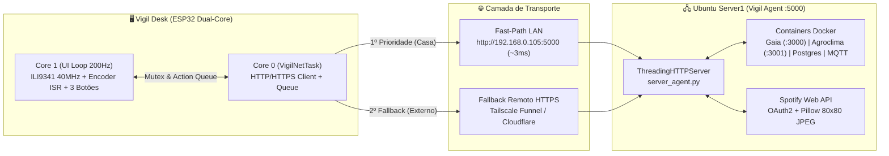

# 📘 Documentação Técnica Completa — Sistema Vigil (v2.0)

> **Observabilidade Física Dual-Core, Media Hub Spotify & DevOps Command Deck para Infraestrutura e IoT**

---

## Sumário

1. [Visão Geral da Arquitetura](#1-visão-geral-da-arquitetura)
2. [Hardware & Pinagem Completa (Vigil Desk)](#2-hardware--pinagem-completa-vigil-desk)
3. [Arquitetura de Firmware (FreeRTOS Dual-Core)](#3-arquitetura-de-firmware-freertos-dual-core)
4. [Manual de Operação das 6 Telas e Controles Físicos](#4-manual-de-operação-das-6-telas-e-controles-físicos)
5. [Backend Vigil Agent & Referência da API REST](#5-backend-vigil-agent--referência-da-api-rest)
6. [Integração Spotify OAuth2 & Processamento de Capa JPEG](#6-integração-spotify-oauth2--processamento-de-capa-jpeg)
7. [Portal Captivo Wi-Fi (Modo AP `Vigil-Setup`)](#7-portal-captivo-wi-fi-modo-ap-vigil-setup)
8. [Guia de Compilação, Particionamento e Implantação](#8-guia-de-compilação-particionamento-e-implantação)

---

## 1. Visão Geral da Arquitetura

O **Sistema Vigil** integra um dispositivo físico de bancada de resposta imediata (**Vigil Desk**, baseado em ESP32) a um agente de telemetria e automação (**Vigil Agent**, em Python) instalado no servidor Linux.



---

## 2. Hardware & Pinagem Completa (Vigil Desk)

### 2.1. Componentes Utilizados
- **Microcontrolador:** ESP32 DevKit V1 (Dual-Core Xtensa® 32-bit LX6 até 240 MHz, 520 KB SRAM, 4 MB Flash).
- **Display:** Módulo TFT LCD 2.8" 240x320 pixels com controlador **ILI9341** (Interface SPI de Hardware a 40 MHz).
- **Seletor Rotativo:** Rotary Encoder **EC11 / KY-040** com chave táctil integrada (`SW`).
- **Deck de Botões:** 3x Push Buttons tácteis NA (Normalmente Abertos) conectados entre o pino GPIO e o `GND`.

### 2.2. Mapa de Pinos (Pinout)

| Grupo | Pino do Módulo | Pino ESP32 | Configuração no Firmware | Função Detalhada |
| :--- | :--- | :--- | :--- | :--- |
| **Display TFT ILI9341** | `CS` | **GPIO 5** | `OUTPUT` | Chip Select do barramento SPI |
| | `DC / RS` | **GPIO 2** | `OUTPUT` | Seleção Dado / Comando |
| | `RST` | **GPIO 4** | `OUTPUT` | Reset de Hardware do Display |
| | `MOSI / SDI` | **GPIO 23** | `VSPI MOSI` | Dados SPI (Master Out Slave In) |
| | `SCK / CLK` | **GPIO 18** | `VSPI SCK` | Clock SPI operando a **40 MHz** |
| | `MISO / SDO` | **GPIO 19** | `VSPI MISO` | Leitura SPI |
| | `SD_CS` | **GPIO 15** | `OUTPUT (HIGH)` | CS do leitor SD (desativado em nível alto para evitar conflito SPI) |
| | `VCC / LED` | **3V3 / 5V** | Alimentação | Alimentação lógica e Backlight |
| **Rotary Encoder** | `CLK (A)` | **GPIO 25** | `INPUT_PULLUP` + `ISR CHANGE` | Fase A da matriz de quadratura |
| | `DT (B)` | **GPIO 26** | `INPUT_PULLUP` + `ISR CHANGE` | Fase B da matriz de quadratura |
| | `SW` | **GPIO 27** | `INPUT_PULLUP` | Clique do Encoder (Trava de Volume / Seleção / Modo AP no boot) |
| **Deck de 3 Botões** | `BTN 1 (PREV)` | **GPIO 32** | `INPUT_PULLUP` | **Faixa Anterior (`⏮`)** no Spotify / **Subir (`▲`)** no menu de Comandos |
| | `BTN 2 (PLAY)` | **GPIO 33** | `INPUT_PULLUP` | **Play/Pause (`⏯`)** no Spotify / **Confirmar (`⚡`)** no menu de Comandos |
| | `BTN 3 (NEXT)` | **GPIO 14** | `INPUT_PULLUP` | **Próxima Faixa (`⏭`)** no Spotify / **Descer (`▼`)** no menu de Comandos |
| **Alimentação** | `GND` | **GND** | Terra Comum | Referência comum para Display, Encoder e os 3 Botões |

> **Nota sobre os Botões Físicos:** Como os pinos `GPIO 32`, `GPIO 33` e `GPIO 14` utilizam resistores internos de pull-up (`pinMode(pin, INPUT_PULLUP)`), **não são necessários resistores externos**. Basta ligar um terminal de cada botão no respectivo GPIO e o outro terminal diretamente no barramento `GND`.

---

## 3. Arquitetura de Firmware (FreeRTOS Dual-Core)

Para eliminar qualquer travamento visual ou perda de pulsos do Encoder durante conexões HTTPS/TLS, o firmware ([`vigil_desk.ino`](firmware/vigil_desk/vigil_desk.ino)) divide o processamento entre os dois núcleos físicos do ESP32:

### 3.1. Core 1 — Interface Gráfica e Entradas Físicas (`200 Hz` / `5 ms`)
- **Decodificador de Quadratura de 16 Estados (`IRAM_ATTR readEncoderISR`):**
  - Utiliza uma tabela de transição de estados (`ENC_TABLE[16]`) acionada nas duas fases (`GPIO 25` e `GPIO 26` em modo `CHANGE`).
  - Filtra automaticamente ruídos mecânicos de *contact bounce* sem usar `delay()`, acumulando os meios-passos e disparando a transição a cada detent completo.
- **Leitura dos 3 Botões Dedicados (`handlePhysicalButtons`):**
  - Amostragem contínua a cada `5 ms` com *debounce* de borda de descida (`HIGH -> LOW`) de `60 ms` e trava de repetição.
- **Renderização Incremental Anti-Flicker ([`DisplayUI.h`](firmware/vigil_desk/DisplayUI.h)):**
  - Apenas as regiões modificadas são redesenhadas a cada ciclo, mantendo a tela estável sem piscar.

### 3.2. Core 0 — Tarefa de Rede Assíncrona (`VigilNetTask`)
- **Fast-Path LAN + Fallback HTTPS:**
  - Quando conectado na mesma rede local do servidor, o `Core 0` prioriza o endpoint HTTP direto (`http://192.168.0.105:5000/api/status`), reduzindo o tempo de resposta de ~1200 ms (TLS handshake) para **~3 a 8 ms**.
  - Caso o IP local não responda (ex.: dispositivo levado para fora de casa), o `Core 0` chaveia automaticamente para a URL pública HTTPS configurada (`https://server1.taila7d06b.ts.net:10000/api/status`).
- **Fila de Ações Imediatas (`pendingAction`):**
  - Cliques nos botões físicos ou giros de volume no Encoder enfileiram comandos instantaneamente para o `Core 0`, que interrompe a espera ociosa, dispara a requisição `POST` para o servidor e agenda uma atualização imediata de estado em `350 ms`.

### 3.3. Orçamento de Memória (Esquema `Huge APP`)
Compilado com `esp32:esp32:esp32:PartitionScheme=huge_app` (`3 MB` para código de aplicação):
- **Flash (Programa):** `1.155.612 bytes` (**36%** de `3.145.728 bytes` — `1.99 MB` livres).
- **SRAM Dinâmica:** `66.044 bytes` (**20%** de `327.680 bytes` — `261 KB` livres para Heap, buffers JPEG e stacks TLS).

---

## 4. Manual de Operação das 6 Telas e Controles Físicos

### 4.1. Comportamento dos Controles por Tela

| Controle Físico | Telas 1, 2, 3, 4 e 6 (Modo Padrão) | Tela 4 (`MODE_SPOTIFY` com Volume Travado) | Tela 5 (`MODE_COMMAND_DECK`) |
| :--- | :--- | :--- | :--- |
| **Girar Encoder** | Troca entre as Telas `1 ↔ 6` | Ajusta Volume do Spotify em **`±5%`** (`0%` a `100%`) | Troca de tela (ou navega nos 6 comandos se travado no Encoder) |
| **Clique Encoder (`GPIO 27`)** | Força atualização imediata | Alterna entre **`[ENC:TELA]`** e **`ENC:VOL`** (amarelo) | Arma / Confirma o comando selecionado (ou trava navegação) |
| **Botão 1 — `PREV` (`GPIO 32`)** | `⏮` Volta para a música anterior no Spotify | `⏮` Volta para a música anterior no Spotify | `▲` Sobe a seleção na lista de comandos (`6 → 1`) |
| **Botão 2 — `PLAY` (`GPIO 33`)** | `⏯` Alterna Play / Pause no Spotify | `⏯` Alterna Play / Pause no Spotify | `⚡` Arma confirmação (`1º clique`) / Executa comando (`2º clique`) |
| **Botão 3 — `NEXT` (`GPIO 14`)** | `⏭` Pula para a próxima música no Spotify | `⏭` Pula para a próxima música no Spotify | `▼` Desce a seleção na lista de comandos (`1 → 6`) |

### 4.2. Detalhamento das 6 Telas

1. **Tela 1 — Servidor Ubuntu (`MODE_SERVER_STATS`):**
   - Exibe status online/offline, temperatura da CPU em destaque com código de cores, barras de progresso de CPU, RAM e Disco SSD, além de taxas de Upload (`TX`) e Download (`RX`) em `KB/s`.
2. **Tela 2 — Estação de Campo (`MODE_FIELD_STATION`):**
   - Exibe dados agrometeorológicos em tempo real da estação remota GAIA (`G00001`): Temperatura, Umidade Relativa, Pressão Atmosférica, Déficit de Pressão de Vapor (`VPD` em kPa) e Evapotranspiração (`ET0`).
3. **Tela 3 — Status dos Serviços (`MODE_SERVICES_STATUS`):**
   - Monitora a disponibilidade das portas TCP dos serviços críticos no servidor (`Gaia Server :3000`, `Agroclima :3001`, `PostgreSQL :5432`, `Mosquitto MQTT :1883`) e exibe o ping de rede em milissegundos.
4. **Tela 4 — Spotify Media Hub (`MODE_SPOTIFY`):**
   - Renderiza a capa do álbum (`80x80` pixels em RGB565 via `TJpg_Decoder`), nome da faixa (até 2 linhas), artista, álbum, barra de progresso interpolada segundo a segundo e barra de volume com indicador de modo do Encoder (`[ENC:TELA]` ou `ENC:VOL`).
5. **Tela 5 — DevOps Command Deck (`MODE_COMMAND_DECK`):**
   - Permite acionar 6 rotinas de manutenção diretamente pelo hardware:
     1. `1. Restart Gaia Server (:3000)`
     2. `2. Restart Agroclima (:3001)`
     3. `3. Restart Mosquitto MQTT (:1883)`
     4. `4. Wake-on-LAN (Ligar PC na Rede)`
     5. `5. Sincronizar / Limpar Cache RAM`
     6. `6. Testar Tunel Publico HTTPS`
   - **Protocolo Safety Lock (3 Segundos):** Ao pressionar `PLAY/EXEC` (`GPIO 33`), a linha selecionada fica **vermelha com borda amarela** (`[CONFIRME]`). O usuário tem **3 segundos** para pressionar novamente e confirmar a execução. Se nenhum botão for pressionado em 3 segundos (ou se mudar de item), o comando é desarmado automaticamente.
6. **Tela 6 — Relógio Digital NTP & Rede (`MODE_CLOCK_WIDGET`):**
   - Relógio de mesa em fonte grande sincronizado com servidores NTP (`a.st1.ntp.br` / `pool.ntp.org`), data completa, nível de sinal Wi-Fi (`dBm`) e endereço IP local.

---

## 5. Backend Vigil Agent & Referência da API REST

O servidor [`server/server_agent.py`](server/server_agent.py) utiliza `ThreadingHTTPServer` na porta `5000`, atendendo múltiplas conexões simultâneas do painel web e do ESP32 sem bloqueio.

### Endpoints Disponíveis

| Método | Rota | Descrição | Exemplo de Retorno |
| :--- | :--- | :--- | :--- |
| `GET` | `/` ou `/dashboard` | Interface Web *Dark Mode Glassmorphism* com gráficos em tempo real | Página HTML5 completa |
| `GET` | `/api/status` | Payload JSON unificado (Servidor, Serviços, Histórico, Estação GAIA e Spotify) | `{"server": {...}, "spotify": {...}}` |
| `GET` | `/api/spotify/art.jpg` | Imagem da capa do álbum atual convertida para **Baseline JPEG 80x80** | Binário `image/jpeg` (~2.5 KB) |
| `POST` / `GET` | `/api/spotify/toggle` | Alterna entre Play e Pause na conta Spotify ativa | `{"ok": true, "action": "toggle"}` |
| `POST` / `GET` | `/api/spotify/next` | Avança para a próxima faixa no Spotify | `{"ok": true, "action": "next"}` |
| `POST` / `GET` | `/api/spotify/prev` | Retorna para a faixa anterior no Spotify | `{"ok": true, "action": "prev"}` |
| `POST` / `GET` | `/api/spotify/volume?val=75` | Define o volume do dispositivo Spotify ativo (`0` a `100`) | `{"ok": true, "action": "volume:75"}` |
| `POST` / `GET` | `/api/cmd/<comando>` | Executa um comando do DevOps Command Deck (`restart_gaia`, `restart_agro`, `restart_mqtt`, `wol`, `clear_cache`, `test_tunnel`) | `{"ok": true, "command": "test_tunnel", "message": "Tunel OK (44ms)"}` |

---

## 6. Integração Spotify OAuth2 & Processamento de Capa JPEG

1. **Configuração de Credenciais (`spotify_config.json`):**
   - O arquivo `spotify_config.json` fica armazenado apenas no servidor (ex.: `/home/leo/spotify_config.json` com permissão `chmod 600`) e está listado no `.gitignore`.
   - Formato do arquivo:
     ```json
     {
       "client_id": "SEU_CLIENT_ID",
       "client_secret": "SEU_CLIENT_SECRET",
       "refresh_token": "SEU_REFRESH_TOKEN"
     }
     ```
2. **Renovação Automática de Token:**
   - A função `get_spotify_token()` renova automaticamente o `access_token` a cada 55 minutos via `https://accounts.spotify.com/api/token`.
3. **Conversão para Baseline JPEG (`update_spotify_art`):**
   - As imagens originais da CDN do Spotify costumam usar compressão *Progressive JPEG* ou dimensões grandes (`300x300` / `640x640`), incompatíveis com decodificadores embarcados leves.
   - O Vigil Agent baixa a capa apenas quando o `track_id` muda, redimensiona para **`80x80` pixels** com filtro `LANCZOS` via biblioteca `Pillow` e salva em memória com `progressive=False` (Baseline JPEG puro de ~2 KB), permitindo que o `TJpg_Decoder` no ESP32 decodifique e desenhe a capa em poucos milissegundos.

---

## 7. Portal Captivo Wi-Fi (Modo AP `Vigil-Setup`)

O Vigil Desk armazena SSID, Senha e URL do Servidor na memória não-volátil (`Preferences` / Flash NVS namespace `vigil_cfg`):

- **Ativação Manual no Boot:** Mantenha o botão do Encoder (`GPIO 27`) pressionado ao energizar o ESP32 por ~1,5 segundo.
- **Ativação Automática (Failover):** Se a rede Wi-Fi salva não for encontrada em até 7 segundos após ligar, o modo AP abre automaticamente.
- **Acesso ao Portal:**
  1. Conecte-se à rede Wi-Fi aberta **`Vigil-Setup`** pelo celular ou computador;
  2. Acesse **`http://192.168.4.1`** no navegador;
  3. Preencha o SSID, a Senha e a URL da API e clique em **Salvar e Conectar**.

---

## 8. Guia de Compilação, Particionamento e Implantação

### 8.1. Compilação via `arduino-cli`
```powershell
# Compilar com esquema de partição Huge APP (3MB App / 1MB SPIFFS)
arduino-cli compile --fqbn esp32:esp32:esp32:PartitionScheme=huge_app firmware/vigil_desk

# Gravar no ESP32 (substitua COMx pela porta serial correspondente)
arduino-cli upload -p COMx --fqbn esp32:esp32:esp32:PartitionScheme=huge_app firmware/vigil_desk
```

### 8.2. Compilação via Arduino IDE
1. Instale o pacote de placas **esp32 by Espressif Systems**;
2. Instale as bibliotecas:
   - `Adafruit GFX Library`
   - `Adafruit ILI9341`
   - `ArduinoJson`
   - `TJpg_Decoder`
3. No menu **Ferramentas (Tools)**:
   - **Placa (Board):** `ESP32 Dev Module`
   - **Partition Scheme:** `Huge APP (3MB No OTA/1MB SPIFFS)`
   - **Upload Speed:** `921600`
4. Clique em **Carregar (Upload)**.

### 8.3. Implantação do Agente no Servidor Linux (`systemd`)
```bash
pip3 install -r server/requirements.txt
sudo cp server/server_agent.py /home/leo/server_agent.py
sudo systemctl restart gaia-monitor-agent
sudo systemctl status gaia-monitor-agent
```
